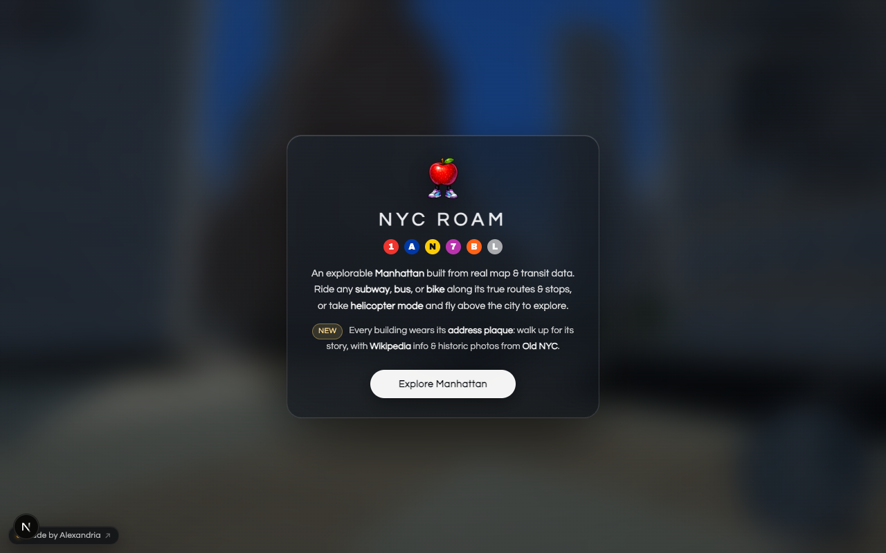

<div align="center">


# NYC Roam: Manhattan

**[www.nycroam.com](https://www.nycroam.com)**

</div>

A browser-based, first-person explorable 3D Manhattan at 1:1 scale: every street,
building, and park from OpenStreetMap on real USGS terrain, with a fully rideable
subway network: walk into any entrance, board trains on all 22 Manhattan services
(correct bullets, strip maps, and headways), ride between real GTFS stop sequences,
and step off at any station, underground or elevated. Every building wears its
street-address plaque: walk up to one for the building's story, with live
Wikipedia summaries and historic NYPL photos via [Old NYC](https://www.oldnyc.org/).

<div align="center">



</div>

## Quick start

```bash
npm install
npm run data:all   # one-time: downloads OSM + NYC Open Data + MTA data, builds tiles
                   # (20–90 min depending on Overpass API load; fully resumable, just rerun)
npm run dev        # http://localhost:3000
```

Raw downloads are cached in `data/cache/`, so re-running the pipeline is fast and
resumable. Generated world data lands in `public/tiles/`, `public/geo/`, `public/subway/`.

## Controls

| | Desktop | Mobile |
|---|---|---|
| Look | click (pointer lock) or drag | drag right side |
| Move | WASD / arrows | left joystick |
| Run | Shift | n/a |
| Fly | F (Space/C for up/down) | FLY button |
| Subway | walk into a green-globe stairway, or E | walk in, or GO button |
| Board a train | stand by the open doors, press E | GO button |
| Ride / exit | E during a stop steps off; ride to the end auto-exits | GO button |
| Building info | walk up to an address plaque, I | tap the info chip |
| Teleport | "Jump to…" menu | same |

## Architecture

- **Data pipeline** (`scripts/`): chunked Overpass API fetch of all Manhattan
  buildings (incl. `building:part` for skyscrapers), roads, parks/water, and trees;
  NYC Open Data borough boundary for the shoreline-clipped island ground; MTA
  Stations CSV + OSM subway entrances for the subway system. Everything is
  reprojected to local meters, pre-triangulated where possible, and binned into
  256 m tiles as compact integer-decimeter JSON.
- **Streaming engine** (`src/engine/`): Three.js. A pool of web workers fetches and
  builds merged per-tile geometry off the main thread (extrusion, roofs via earcut,
  road ribbons, procedural rooftop water towers, instanced trees). Tiles stream in
  by distance, capped per frame, and dispose beyond the fog. A low-poly skyline layer
  (every building ≥ 70 m island-wide) renders beyond the fog with a distance haze so
  the Midtown/Downtown skylines are always on the horizon.
- **Facades**: one shared Lambert material with an injected shader that carves
  per-floor window grids (and ground-floor storefronts) from world position: zero
  textures, one draw call per tile layer.
- **Subway** (`src/engine/subway/`): station interiors are generated from each
  station's real spec: IRT vs IND/BMT platform lengths, side/island/dual-island
  platform types (curated for ~35 major stations, heuristic elsewhere), express
  pass-through tracks, trunk-color tile bands, station-name mosaics, columns,
  benches, fare control with turnstiles and booth, and animated arriving trains
  with the correct route bullets. Exit stairs return you to the sidewalk entrance
  you came from.
- **Landmarks** (`src/engine/landmarks/`): 101 premium landmarks (Chrysler crown,
  Brooklyn Bridge cables, the Oculus, Bethesda Terrace, the Statue of Liberty on the
  harbor horizon...) built procedurally in themed modules that dynamic-import and
  construct only when approached, then dispose on leaving; distant districts cost
  zero bytes and zero triangles. The tile pipeline suppresses generic OSM massing
  where a bespoke build replaces it.
- **Building plaques** (`src/engine/PlaqueManager.ts` + `scripts/build-plaques.mjs`):
  ~90k street-address plaques, one on each numbered building's street-facing wall,
  batched as a single canvas-atlas mesh per tile. Walking up opens an info modal
  with the address, building type, a live Wikipedia summary (via the building's
  OSM wikidata/wikipedia tags), and a historic-photo link snapped to the nearest
  of Old NYC's 9k geocoded markers (computed at build time, coordinates only,
  no images redistributed).
- **Performance**: fog-matched draw distance, mobile-specific pixel ratio/radius,
  frustum culling, merged geometry (~2 draw calls per tile + instancing),
  velocity-led tile streaming (the loader leads fast movers by up to ~6 s of
  travel so bikes and the helicopter stay ahead of the fog), and localStorage
  position persistence.

## Appearance

Everything is generated at runtime: no downloaded assets. Procedural canvas
textures (brick, sidewalk flags, asphalt, roof ballast, terrazzo, glossy subway
tile with grime, bark, clouds) ship with Sobel-derived normal maps; buildings
split into curtain-wall vs punched-masonry styles; streets carry lane lines and
continental crosswalks; the sun casts real-time shadows (desktop tier) with a
camera-following texel-snapped frustum; rivers animate with fresnel and glints.
Mobile keeps a lean shadowless tier automatically.

## Data sources

Everything in the world comes from public map and transit data. Full license
terms for each are in [NOTICE.md](NOTICE.md).

- **[© OpenStreetMap contributors](https://www.openstreetmap.org/copyright)
  ([ODbL](https://opendatacommons.org/licenses/odbl/1-0/))**: buildings, roads,
  parks and water, trees, subway entrances, bus stops. Fetched from the
  [Overpass API](https://overpass-api.de/) — see the note below before running
  the pipeline.
- **MTA**: subway stations, routes and structure types; GTFS static for route
  stop sequences and travel times, subway and bus
- **NYC Open Data**: borough boundaries (the water-clipped island ground) and
  2020 Neighborhood Tabulation Areas (the live location label)
- **USGS / AWS Terrain Tiles** (Terrarium): elevation
- **Citi Bike (GBFS `station_information`)**: public bike dock locations and capacities
- **[Old NYC](https://www.oldnyc.org/)** (Apache-2.0): geocoded historic-photo marker
  coordinates for the building-info deep links — link-out only, no images
  redistributed; the photos are NYPL's
- **Wikipedia / Wikidata** (CC BY-SA): live building summaries fetched in the
  browser, attributed in the info modal

Station interiors are stylized approximations informed by public documentation of
NYC station layouts (see e.g. Project Subway NYC for the real things); no
third-party 3D models or photographs are included.

> **Running the pipeline?** `npm run data:all` pulls all of Manhattan from
> Overpass, which is volunteer-funded infrastructure. The fetcher already
> chunks its queries, identifies itself, backs off on rate limits, and caches
> to `data/cache/` so re-runs are free — please keep that intact and read the
> [Overpass usage policy](https://operations.osmfoundation.org/policies/overpass/).
> If you only want to run the app, the built world is already committed under
> `public/`; you don't need to fetch anything.

## Configuration

Optional, all build-time. Copy [.env.example](.env.example) to `.env.local`:

| Variable | Effect |
|---|---|
| `NEXT_PUBLIC_GA_ID` | Google Analytics 4 measurement ID. Unset (the default) ships no analytics tag at all. |
| `NEXT_PUBLIC_SITE_URL` | Pins the absolute origin for `og:image` and canonical URLs. On Vercel it falls back to the deployment URL. |

## Known limitations

- Riding between stations is a stylized car-interior experience (scrolling tunnel +
  arrival backdrops), not a continuous modeled tunnel network.
- Bridges render elevated but aren't walkable; station complexes model the primary
  platform set rather than full passageway networks; procedural trees approximate
  real planting.
- Headways are gamified (~30 s per direction) rather than schedule-accurate.

## License

The code is [MIT](LICENSE). What the repo *ships* is not only code, and the MIT
license does not reach the rest of it — see **[NOTICE.md](NOTICE.md)** for the
full inventory. In short:

- The generated world data (`public/tiles/`, `public/geo/`, `public/subway/`) is
  a **derivative database of OpenStreetMap**, © OpenStreetMap contributors under
  [ODbL](https://opendatacommons.org/licenses/odbl/1-0/). Keep the attribution
  visible, and publish any modified world database under ODbL.
  ([public/DATA-LICENSE.txt](public/DATA-LICENSE.txt))
- The self-hosted fonts are SIL OFL, with license texts bundled in `public/fonts/`.
- Old NYC marker coordinates are Apache-2.0 ([licenses/Apache-2.0.txt](licenses/Apache-2.0.txt));
  the photos remain NYPL's, and the app links out rather than redistributing any.
- Terrain, transit and bike-share data carry the terms of the sources listed above.
- The sound effects in `public/audio/` are ElevenLabs-generated and are **not**
  MIT — source your own if you fork this.
